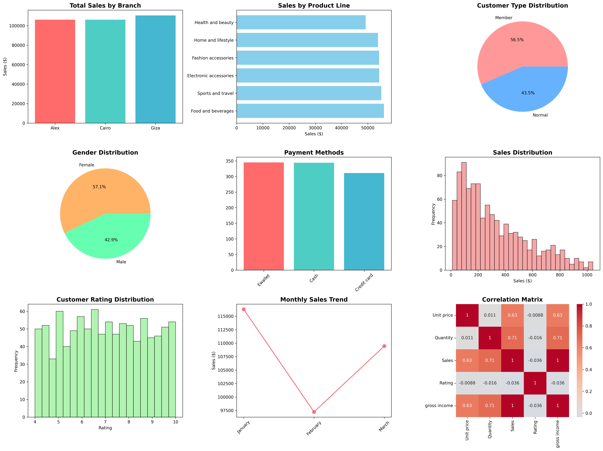

# 🏪 Supermarket Sales Analysis

A comprehensive data analytics project analyzing supermarket sales data with Python, featuring interactive visualizations, statistical analysis, and machine learning insights.

## 📊 Project Overview

This project analyzes supermarket sales data to uncover business insights including:
- Sales performance by branch and product line
- Customer behavior patterns
- Revenue trends and seasonality
- Customer segmentation using machine learning
- Interactive visualizations and dashboards

## 🚀 Quick Start

### Prerequisites
- Python 3.7+
- pip package manager

### Installation & Setup

1. **Clone or download this repository**
   ```bash
   git clone <repository-url>
   cd supermarket-sales-analysis
   ```

2. **Install required packages**
   ```bash
   pip install -r requirements.txt
   ```

3. **Run the analysis**
   ```bash
   python run_analysis.py
   ```

## 📁 Project Structure

```
supermarket-sales-analysis/
├── data/
│   └── SuperMarket Analysis.csv    # Raw sales data
├── supermarket_analysis.py         # Main analysis script
├── run_analysis.py                 # Simple runner script
├── requirements.txt                # Python dependencies
└── README.md                       # This file
```

## 📈 Features

### 🔍 Data Analysis
- **Basic Statistics**: Revenue, transactions, averages
- **Branch Performance**: Sales comparison across locations
- **Product Analysis**: Best-selling product lines
- **Customer Insights**: Member vs normal customers, gender distribution
- **Payment Methods**: Cash, credit card, e-wallet analysis

### 📊 Visualizations
- **Dashboard**: 9-panel comprehensive overview
- **Interactive Plots**: Plotly-powered HTML visualizations
- **Statistical Charts**: Histograms, correlation matrices
- **Business Metrics**: KPI tracking and trends

### 🤖 Machine Learning
- **Customer Segmentation**: K-means clustering
- **Pattern Recognition**: Behavioral analysis
- **Predictive Insights**: Data-driven recommendations

## 📋 Generated Outputs

After running the analysis, you'll get:

1. **`supermarket_analysis_dashboard.png`** - Main visual dashboard
2. **`sales_sunburst.html`** - Interactive city/branch breakdown
3. **`sales_scatter.html`** - Interactive sales vs price analysis
4. **`analysis_report.txt`** - Detailed text report with insights

### Sample Dashboard Output



*The dashboard provides a comprehensive 9-panel view of sales performance, customer demographics, product analysis, and key business metrics.*

## 🛠️ Usage Examples

### Basic Analysis
```python
from supermarket_analysis import SupermarketAnalyzer

# Initialize analyzer
analyzer = SupermarketAnalyzer('data/SuperMarket Analysis.csv')

# Run complete analysis
analyzer.run_complete_analysis()
```

### Custom Analysis
```python
# Just basic statistics
analyzer.basic_stats()

# Only visualizations
analyzer.create_visualizations()

# Advanced analytics only
analyzer.advanced_analysis()
```

## 📊 Sample Insights

The analysis reveals key business insights such as:
- **Revenue Performance**: Total sales across branches
- **Product Popularity**: Best-performing product lines
- **Customer Behavior**: Shopping patterns and preferences
- **Seasonal Trends**: Monthly sales variations
- **Customer Satisfaction**: Rating analysis

## 🔧 Dependencies

- **pandas**: Data manipulation and analysis
- **numpy**: Numerical computing
- **matplotlib**: Static plotting
- **seaborn**: Statistical visualization
- **plotly**: Interactive visualizations
- **scikit-learn**: Machine learning algorithms

## 📝 Data Schema

The dataset includes the following columns:
- `Invoice ID`: Unique transaction identifier
- `Branch`: Store branch (A, B, C)
- `City`: Location (Yangon, Naypyitaw, Mandalay)
- `Customer type`: Member or Normal
- `Gender`: Male or Female
- `Product line`: Product category
- `Unit price`: Price per item
- `Quantity`: Number of items
- `Sales`: Total transaction amount
- `Date`: Transaction date
- `Time`: Transaction time
- `Payment`: Payment method
- `Rating`: Customer satisfaction (1-10)

## 🎯 Business Applications

- **Inventory Management**: Optimize stock based on product performance
- **Marketing Strategy**: Target high-value customer segments
- **Store Operations**: Improve branch performance
- **Customer Experience**: Enhance satisfaction based on ratings
- **Revenue Optimization**: Focus on profitable product lines

## 🤝 Contributing

1. Fork the repository
2. Create a feature branch
3. Make your changes
4. Add tests if applicable
5. Submit a pull request


## 🆘 Troubleshooting

### Common Issues

**Missing dependencies:**
```bash
pip install -r requirements.txt
```

**Data file not found:**
Ensure `SuperMarket Analysis.csv` is in the `data/` folder

**Permission errors:**
Run with appropriate permissions or use virtual environment

### Support

If you encounter issues:
1. Check the error message in the console
2. Verify all dependencies are installed
3. Ensure data file is in correct location
4. Check Python version compatibility (3.7+)

---

**Made with ❤️ for data-driven business insights**